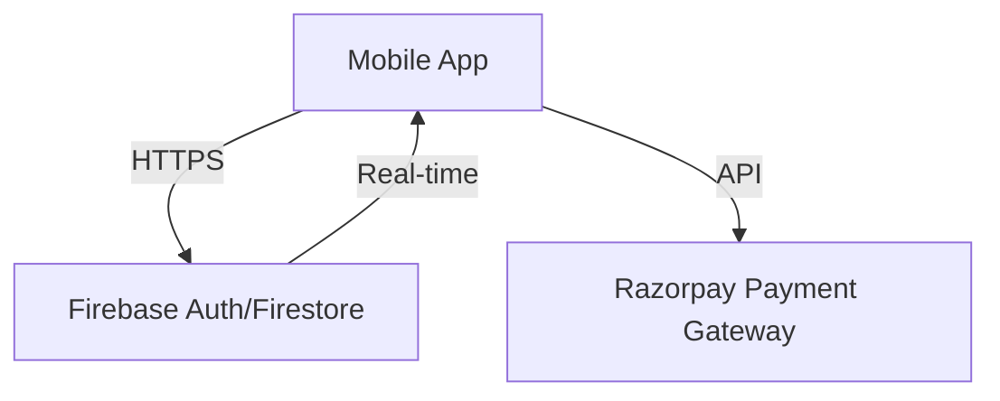

# Software Requirements Specification (SRS) for Cartpro Turf Booking System

## 1. Introduction
### 1.1 Purpose
The purpose of this document is to outline the functional and non-functional requirements for **Cartpro**, an interactive turf booking platform. The system aims to simplify the process of discovering and booking sports turfs for players while providing a robust management tool for turf owners.

### 1.2 Project Scope
The scope of Cartpro defines the boundaries of the current system's capabilities and limitations.

#### 1.2.1 What the System Can Do (In-Scope)
*   **User Management:** Registration and Login for Players and Owners with Role-Based Access Control.
*   **Turf Discovery:** Interactive map view showing nearby verified turfs with "My Location" tracking.
*   **Booking System:** View turf details, select date and multiple time slots, and confirm bookings.
*   **Payments:** Integration with Razorpay for processing payments securely in test mode.
*   **Owner Management:** Owners can add, update, and delete their turf profiles.
*   **Admin Control:** Admins can view pending turf requests and Approve or Reject them.
*   **Persistence:** All data (Users, Turfs, Bookings) is persisted in a cloud NoSQL database (Firestore).

#### 1.2.2 What the System Cannot Do (Out-of-Scope)
*   **Offline Mode:** The application requires an active internet connection to function; offline booking is not supported.
*   **Dynamic Pricing:** The current version supports fixed hourly rates only; peak/off-peak pricing is not implemented.
*   **Tournament Management:** Organizing leagues or tournaments is outside the scope of this version.
*   **In-App Chat:** Direct messaging between players and owners is not included; communication relies on external phone contact.

## 2. System Architecture

---
*Note: This document is part of the MCA Semester 2 project documentation.*
